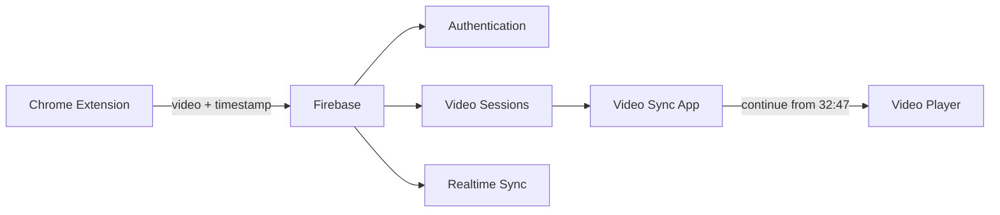

# Video Sync

> Cross-device video handoff: push what you're watching — with your exact position — from your browser, and continue on any other device in one tap.

## The Problem

You're 32:47 into a video on your laptop. Later you want to finish it on your phone. Now you have to remember what it was, find it again, open the right one, and scrub to the right spot — especially annoying when history is off, you use different platform accounts per device, or the video is on an unfamiliar site.

## The Solution

**Push Video → Sync → Continue Watching**

1. While watching a video, click **PUSH VIDEO** in the Video Sync Chrome extension.
2. The video's URL, title, thumbnail, platform, and your exact playback position sync to your account.
3. Open Video Sync on any other device — the video is waiting under **Continue Watching**, one tap from resuming at the saved timestamp.

## How It Works



- The **Chrome extension** detects the video you're watching (platform adapter system), authenticates with **Firebase Authentication**, and writes the session to **Firebase Realtime Database**.
- The **app** (Expo / React Native — Android, iOS, web) subscribes to your data in real time, so pushed videos appear without a refresh.
- Your data lives under `users/{your-uid}/…` and the database security rules (`database.rules.json`) make every read and write accessible **only to your own account**.

## Features

### Implemented

- Email/password **sign up, log in, log out** with persistent sessions (app and extension share the same Firebase account system)
- **Realtime sync** — pushes appear in the app instantly
- **Continue Watching** hero card with one-tap resume
- **Recent videos** history with thumbnails, platform, position, and relative time
- **Video details** screen (platform, position, saved time, source device)
- **Profile** with account info, registered devices, and sign-out
- YouTube **timestamp restoration** (`?t=` deep links)
- Generic HTML5 video detection on any website
- Graceful loading, empty, and error states; friendly auth/API error messages
- Locked-down Firebase security rules with per-field validation

### In Progress

- Push confirmation sync-back (extension currently shows local success only)

### Planned

- More platform adapters (Netflix/Prime/Disney+ require DRM-locked players — see Limitations)
- "Mark as watched" / session management actions
- Push from mobile web via share target

## Supported Platforms

| Platform | Detection | Timestamp restore | Status |
|---|---|---|---|
| YouTube (watch, shorts, embed, youtu.be) | URL, title, thumbnail, position | Yes | Tested |
| Any site with a standard HTML5 `<video>` | URL, page title, poster, position where exposed | No (site-dependent) | Best effort |

Do not expect support for DRM-locked services — see [Limitations](#limitations).

## Tech Stack

| Layer | Technology |
|---|---|
| App | Expo (React Native), expo-router, TypeScript |
| Backend | Firebase Authentication (email/password) |
| Database | Firebase Realtime Database (realtime listeners + REST) |
| Extension | Chrome MV3, vanilla JS, Firebase Auth via Identity Toolkit REST API |
| Security | RTDB rules with per-user isolation and schema validation |

## Architecture

```
video-sync/
├── video-sync-app/            Expo app (Android · iOS · web)
│   ├── app/
│   │   ├── index.tsx          Landing / setup notice
│   │   ├── (auth)/            login · signup
│   │   ├── (tabs)/            Home (Continue Watching) · Profile
│   │   └── video/[id].tsx     Video details
│   ├── lib/
│   │   ├── firebase.ts        SDK init (env-driven, platform-split persistence)
│   │   ├── auth.tsx           AuthProvider context
│   │   ├── db.ts              RTDB data layer + realtime subscriptions
│   │   ├── platforms.ts       Platform adapters / continue-URL builder
│   │   ├── format.ts          Time + date formatting
│   │   └── device.ts          Per-install device identity
│   └── components/            VideoCard, Button, Field, theming
├── video-sync-extension/      Chrome MV3 extension
│   ├── manifest.json
│   ├── background.js          Service worker: authenticated writes
│   ├── content.js             Page bridge (video detection)
│   ├── platforms.js           Adapter registry (YouTube + generic)
│   ├── popup.html/js          Auth + PUSH VIDEO UI
│   ├── config.js              Firebase web config (paste your apiKey)
│   └── lib/                   REST auth + RTDB writer
├── database.rules.json        RTDB security rules
└── firebase.json              Firebase CLI config (rules deployment)
```

### Data model

```
users/{uid}
├── profile              { username, email, createdAt }
├── latest               VideoSession   ← Continue Watching
├── sessions/{pushId}    VideoSession   ← history (last 60)
└── devices/{deviceId}   { name, lastSeen, createdAt }

VideoSession = { platform, url, title, thumbnail, time,
                 deviceId, deviceName, createdAt, updatedAt }
```

## Getting Started

### Prerequisites

- Node.js 18+ and npm
- A [Firebase](https://console.firebase.google.com) project (free Spark plan is enough)
- Google Chrome (for the extension)

### 1. Clone and install

```bash
git clone https://github.com/YOUR_USERNAME/Video-sync_Project.git
cd Video-sync_Project/video-sync-app
npm install
```

### 2. Configure Firebase

1. Open the [Firebase console](https://console.firebase.google.com) and create (or open) a project.
2. **Authentication → Sign-in method → enable *Email/Password*.**
3. **Realtime Database → Create database** (choose your region; start in locked mode).
4. **Project settings → General → Your apps → Web app (`</>`)** — copy the shown config values.
5. Paste them into the env file:

   ```bash
   cd video-sync-app
   cp .env.example .env    # then fill in the values
   ```

6. Open `video-sync-extension/config.js` and paste the same `apiKey` (the other values are pre-filled for this project's database — update them if you use your own project).
7. Deploy the security rules once:

   ```bash
   npm install -g firebase-tools
   firebase login
   firebase deploy --only database
   ```

### 3. Run the app

```bash
# from video-sync-app/
npm start          # Expo dev server
# then press: w = web · a = Android emulator · i = iOS simulator
# or scan the QR code with Expo Go on your phone
```

### 4. Load the extension

1. Open `chrome://extensions`.
2. Enable **Developer mode** (top right).
3. Click **Load unpacked** and select the `video-sync-extension/` folder.
4. Pin the extension, open its popup, and **sign up / log in** with the same account as the app.

## Usage

1. Watch any video (start with YouTube).
2. Click the Video Sync icon → review the detected video → **PUSH VIDEO**.
3. Open the app on another device (phone, tablet, another browser) and log into the same account.
4. Tap **Continue Watching** — the video opens at your saved position where the platform supports it.

## Limitations

Being honest about what's technically possible:

- **Timestamp restoration** works where a URL parameter can express it (YouTube). Most sites cannot be seeked via URL, so videos open from the start — the app says so instead of pretending.
- **DRM platforms** (Netflix, Disney+, Prime Video) wrap players in encrypted, sandboxed UIs. Detecting titles or positions there is unreliable, against their terms of service in some cases, and not implemented.
- **Login-protected or browser-restricted pages** (chrome:// pages, Chrome Web Store, some SPAs) can't be inspected by the extension.
- The extension requests only `activeTab` — it can't see anything until you click it.

## Roadmap

- [x] Firebase Authentication (app + extension)
- [x] Realtime Continue Watching
- [x] Session history
- [x] YouTube timestamp restoration
- [ ] More platform adapters
- [ ] Session management (mark watched, delete)
- [ ] Public release builds (EAS)

## Contributing

PRs are welcome. Keep the scope tight: platform adapters, UI polish, and bug fixes are the best places to start.

1. Fork and create a branch (`feat/my-feature`).
2. In `video-sync-app/`, `npx tsc --noEmit` and `npx eslint .` must pass.
3. Test the full flow (extension push → app receive) before submitting.

## License

No license is included yet — all rights reserved by the project owner until one is chosen. (MIT is a reasonable default for a project like this; the owner should decide before publishing.)

## Screenshots / Demo

To be added from real runs — no fake screenshots.
