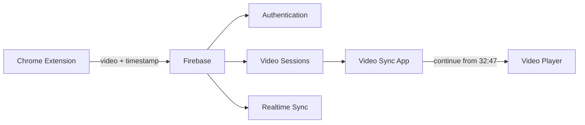

# Video Sync

> Cross-device video handoff: push what you're watching — with your exact position — from your browser, and continue on your phone in one tap.

**For Users:** everything you need is in the [Download](#download) section below — install the Android app, install the Chrome extension, sign in with the same account on both. The app is a standalone APK: you don't need Expo, Node.js, or any build tools, and there is no Firebase project to create or configure. Everything is already set up inside the app.

**For Developers:** everything you need to build Video Sync from source is in the [developer section](#for-developers--contributors) below.

---

## Download

Video Sync does one thing well: you're 32:47 into a video on your laptop, and later you finish it on your phone at exactly 32:47.

The flow: **YouTube → Chrome extension → PUSH VIDEO → Video Sync app → Continue Watching**

### Android

1. **Open the latest GitHub Release** — go to the [Releases page](https://github.com/aniketm112/Video-sync_Project/releases/latest).
2. **Download `Video-Sync.apk`** from the release's Assets. (You can also grab `Video-Sync-Extension.zip` from the same release for step 5.)
3. **Install the APK** on your Android phone or tablet: open the downloaded file, and if Android asks for permission to install apps from your browser or file manager, tap **Allow** — this is normal for apps installed outside the Play Store. Then tap **Install** → **Open**.
4. **Create or sign into your Video Sync account** in the app (name, email, password). Firebase Authentication is built in — you never enter server settings, keys, or configuration, and you never create your own Firebase project. Use the **same account on every device** — that's what keeps your videos in sync.
5. **Install the Chrome extension on your computer**: unzip `Video-Sync-Extension.zip`, open `chrome://extensions`, turn on **Developer mode** (top-right toggle), click **Load unpacked**, and select the unzipped folder. Pin the Video Sync icon to your toolbar.
6. **Sign into the same account** in the Video Sync extension popup. The released extension is pre-configured — there is no setup beyond signing in.
7. **Push a video and continue watching it on your phone**: watch any YouTube video in Chrome, click the Video Sync icon → check the detected video → **PUSH VIDEO**. It appears instantly under **Continue Watching** in the app — tap it and YouTube opens at your saved position.

That's the entire setup. Everything you push syncs automatically to every device signed into your account, in real time — no refresh needed. You never need Expo Go, the Expo CLI, Node.js, Android Studio, or any Firebase configuration: all of that ships inside `Video-Sync.apk` and `Video-Sync-Extension.zip`.

---

## How It Works



- The **Chrome extension** detects the video you're watching (platform adapter system), authenticates with **Firebase Authentication**, and writes the session to **Firebase Realtime Database**.
- The **Video Sync app** (React Native) subscribes to your data in real time, so pushed videos appear without a refresh.
- Your data lives under `users/{your-uid}/…` and the database security rules (`database.rules.json`) make every read and write accessible **only to your own account**.

## Features

### Implemented

- Email/password **sign up, log in, log out** with persistent sessions (app and extension share the same Firebase account system)
- **Realtime sync** — pushes appear in the app instantly
- **Continue Watching** hero card with one-tap resume
- **Recent videos** history with thumbnails, platform, position, and relative time
- **Video details** screen (platform, position, saved time, source device)
- **Profile** with account info, registered devices, and sign-out
- YouTube **timestamp restoration** (`?t=` deep links)
- Generic HTML5 video detection on any website
- Graceful loading, empty, and error states; friendly auth/API error messages
- Locked-down Firebase security rules with per-field validation
- Standalone installable **Android APK** built from the committed native Gradle project

### In Progress

- Push confirmation sync-back (extension currently shows local success only)

### Planned

- More platform adapters (Netflix/Prime/Disney+ require DRM-locked players — see Limitations)
- "Mark as watched" / session management actions
- iOS app build

## Supported Platforms

| Platform | Detection | Timestamp restore | Status |
|---|---|---|---|
| YouTube (watch, shorts, embed, youtu.be) | URL, title, thumbnail, position | Yes | Tested |
| Any site with a standard HTML5 `<video>` | URL, page title, poster, position where exposed | No (site-dependent) | Best effort |

Do not expect support for DRM-locked services — see [Limitations](#limitations).

---

## For Developers / Contributors

Everything in this section is required **only** when setting up or developing the project from source. Normal users never touch any of it — they install the released APK and extension, which ship with the Firebase configuration already baked in at build time.

> **Security note:** no real Firebase API key, password, or credential belongs in this repository or this README. Local configuration files (`.env`, `config.js`) are machine-specific and gitignored or placeholder-only in the repo. The released APK and extension zip are built with the project's Firebase configuration applied **at build time**, on the maintainer's machine.

### Prerequisites

- Node.js 18+ and npm
- JDK 17 (the Gradle build does not run on newer JDKs like 26)
- Android SDK (or Android Studio, which bundles one)
- A [Firebase](https://console.firebase.google.com) account (free Spark plan is enough)
- Google Chrome (for the extension)

### 1. Clone and install

```bash
git clone https://github.com/aniketm112/Video-sync_Project.git
cd Video-sync_Project/video-sync-app
npm install
```

The npm dependencies are required for the Gradle build — the release build compiles the JavaScript bundle, which needs them on disk.

### 2. Firebase project setup

Firebase Authentication (email/password) and the Realtime Database data layer are already integrated into the application — the code needs no changes to use them. What you set up here is your own Firebase project to develop against:

1. Open the [Firebase console](https://console.firebase.google.com) and create a project.
2. **Authentication → Sign-in method → enable *Email/Password*.**
3. **Realtime Database → Create database** (choose your region; start in locked mode).
4. **Project settings → General → Your apps → Web app (`</>`)** — copy the shown config values.

### 3. App configuration (`.env`)

```bash
cd video-sync-app
cp .env.example .env    # then fill in the values from your Firebase web app config
```

The values are compiled into the app bundle at build time — which is why released APKs need no user configuration.

### 4. Security rules

The RTDB rules in `database.rules.json` enforce per-user isolation and field validation. Deploy them once (and after edits):

```bash
npm install -g firebase-tools
firebase login
firebase deploy --only database
```

### 5. Extension configuration

Open `video-sync-extension/config.js` and paste your Firebase `apiKey` (the other values point at this project's database — update them if you use your own project). This file is placeholder-only in git; your real key stays local.

### 6. Build and run

Build the release APK as described in the [Android APK](#android-apk) section, then install it on a connected device:

```bash
adb install android/app/build/outputs/apk/release/app-release.apk
```

Load the extension for pushing: `chrome://extensions` → Developer mode → **Load unpacked** → select `video-sync-extension/` → sign in with the same account.

---

# Android APK

The repository contains the **native Android project** (`video-sync-app/android/`) with the Gradle wrapper checked in. Building is a single Gradle command on any machine with JDK 17 + Android SDK.

### Build the release APK

```bash
cd video-sync-app
cd android
gradlew assembleRelease        # macOS/Linux: ./gradlew assembleRelease
```

On first run Gradle downloads its distribution and dependencies, so expect a long first build; later builds are much faster.

**Output — verified:**

```
video-sync-app/android/app/build/outputs/apk/release/app-release.apk
```

`assembleRelease` signs with the debug keystore by default, which is fine for side-loading and testing. For Play Store distribution, create a proper upload keystore and wire it into `android/app/build.gradle`'s `signingConfigs` — never commit that keystore.

### Distribute a release

Releases are published on the repo's [Releases page](https://github.com/aniketm112/Video-sync_Project/releases) with two assets:

- `Video-Sync.apk` — the built release APK
- `Video-Sync-Extension.zip` — the extension folder zipped **with the real `config.js` included** (built locally at packaging time; the repo copy keeps a placeholder)

To publish one:

```bash
# build the APK (above), zip the configured extension, then:
git tag v1.0.0 && git push origin v1.0.0
gh release create v1.0.0 Video-Sync.apk Video-Sync-Extension.zip --title "Video Sync v1.0.0" --notes "First release"
```

(or create the release through the GitHub web UI: **Releases → Draft a new release → attach the files**). The GitHub CLI (`gh`) is not required — the web UI does the same thing.

---

## Tech Stack

| Layer | Technology |
|---|---|
| App | React Native (TypeScript), compiled to a native Android app with Gradle |
| Native targets | Android — committed native project (`video-sync-app/android/`); iOS — same React Native codebase, built with the standard Xcode toolchain |
| Navigation | React Navigation |
| Backend | Firebase Authentication (email/password), integrated in the app and extension |
| Database | Firebase Realtime Database (realtime listeners + REST) |
| Extension | Chrome MV3, vanilla JS, Firebase Auth via Identity Toolkit REST API |
| Security | RTDB rules with per-user isolation and schema validation |

Android is the shipped platform today; the codebase is cross-platform React Native, so an iOS build reuses all of the app code.

## Architecture

```
Video-sync_Project/
├── video-sync-app/            React Native app (Android · web)
│   ├── android/               Native Android project (Gradle, wrapper committed)
│   │   └── app/               APK module — assembleRelease builds here
│   ├── app/
│   │   ├── index.tsx          Landing / setup notice
│   │   ├── (auth)/            login · signup
│   │   ├── (tabs)/            Home (Continue Watching) · Profile
│   │   └── video/[id].tsx     Video details
│   ├── lib/
│   │   ├── firebase.ts        Firebase SDK init (env-driven, platform-split persistence)
│   │   ├── auth.tsx           AuthProvider context
│   │   ├── db.ts              RTDB data layer + realtime subscriptions
│   │   ├── platforms.ts       Platform adapters / continue-URL builder
│   │   ├── format.ts          Time + date formatting
│   │   └── device.ts          Per-install device identity
│   └── components/            VideoCard, Button, Field, theming
├── video-sync-extension/      Chrome MV3 extension
│   ├── manifest.json
│   ├── background.js          Service worker: authenticated writes
│   ├── content.js             Page bridge (video detection)
│   ├── platforms.js           Adapter registry (YouTube + generic)
│   ├── popup.html/js          Auth + PUSH VIDEO UI
│   ├── config.js              Firebase web config (placeholder in git, real key at packaging)
│   ├── lib/                   REST auth + RTDB writer
│   └── tools/                 detect-test.mjs, e2e-push-test.mjs (node test harnesses)
├── database.rules.json        RTDB security rules
└── firebase.json              Firebase CLI config (rules deployment)
```

### Data model

```
users/{uid}
├── profile              { username, email, createdAt }
├── latest               VideoSession   ← Continue Watching
├── sessions/{pushId}    VideoSession   ← history (last 60)
└── devices/{deviceId}   { name, lastSeen, createdAt }

VideoSession = { platform, url, title, thumbnail, time,
                 deviceId, deviceName, createdAt, updatedAt }
```

## Usage

1. Watch any video (start with YouTube).
2. Click the Video Sync icon → review the detected video → **PUSH VIDEO**.
3. Open the app on another device and log into the same account.
4. Tap **Continue Watching** — the video opens at your saved position where the platform supports it.

## Limitations

Being honest about what's technically possible:

- **Timestamp restoration** works where a URL parameter can express it (YouTube). Most sites cannot be seeked via URL, so videos open from the start — the app says so instead of pretending.
- **DRM platforms** (Netflix, Disney+, Prime Video) wrap players in encrypted, sandboxed UIs. Detecting titles or positions there is unreliable, against their terms of service in some cases, and not implemented.
- **Login-protected or browser-restricted pages** (chrome:// pages, Chrome Web Store, some SPAs) can't be inspected by the extension.
- The extension requests only `activeTab` — it can't see anything until you click it.

## Roadmap

- [x] Firebase Authentication (app + extension)
- [x] Realtime Continue Watching
- [x] Session history
- [x] YouTube timestamp restoration
- [x] Native Android project + standalone release APK (Gradle)
- [ ] More platform adapters
- [ ] Session management (mark watched, delete)
- [ ] Play Store distribution with a production keystore
- [ ] iOS app build

## Contributing

PRs are welcome. Keep the scope tight: platform adapters, UI polish, and bug fixes are the best places to start.

1. Fork and create a branch (`feat/my-feature`).
2. In `video-sync-app/`, `npx tsc --noEmit` and `npx eslint .` must pass; in `video-sync-extension/`, `node tools/detect-test.mjs` must pass.
3. Test the full flow (extension push → app receive) before submitting.

## License

No license is included yet — all rights reserved by the project owner until one is chosen. (MIT is a reasonable default for a project like this; the owner should decide before publishing.)

## Screenshots / Demo

To be added from real runs — no fake screenshots.
